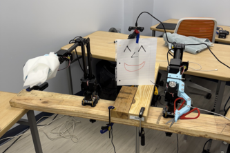
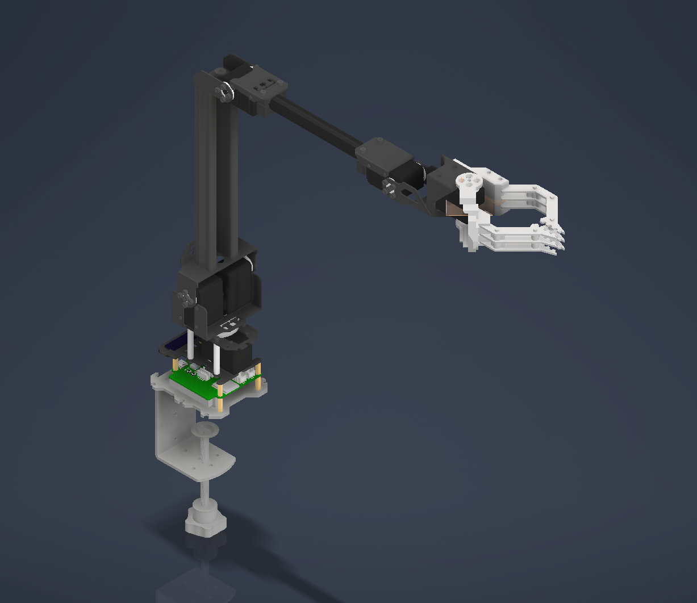
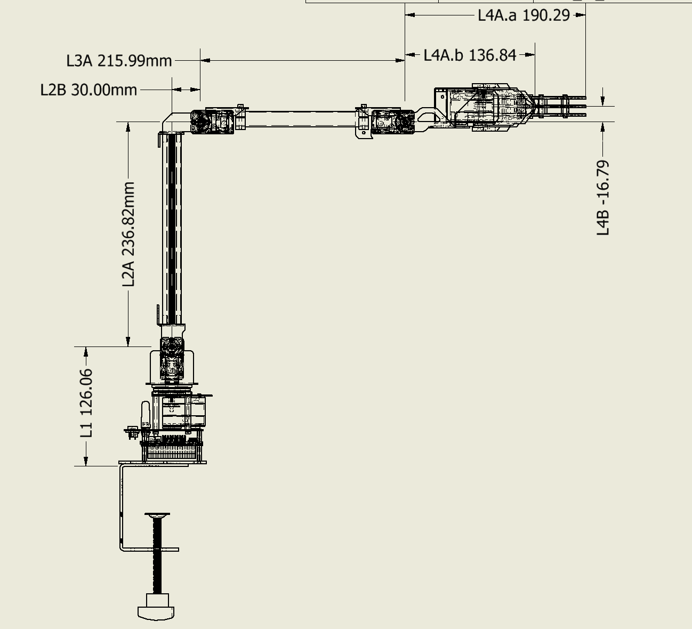

<!-- PROJECT LOGO -->
 

    

  <h1 align="center">Dr. Andy</h1>

  

    The Deployable Surgeon in a Box
     
    <a href="https://devpost.com/software/y-u9oxsk"><strong>Devpost »</strong></a>
     
     
    <a href="https://github.com/taogroves">Tao Groves</a>
    ·
    <a href="https://github.com/alexanderhalpern">Alexander Halpern</a>
    ·
    <a href="https://github.com/abhinavp5">Abhinav Pappu</a>
    ·
    <a href="https://github.com/paris-phan">Paris Phan</a>
  

<!-- TABLE OF CONTENTS -->

  
Table of Contents

  <ol>
    <li>
      <a href="#about-the-project">About The Project</a>
      <ul>
        <li><a href="#built-with">Built With</a></li>
      </ul>
    </li>
    <li>
      <a href="#technologies">Technologies</a>
      <ul>
        <li><a href="#vr-integration">VR Integration</a></li>
        <li><a href="#robotics">Robotics</a></li>
        <li><a href="#vision-system">Vision System</a></li>
        <li><a href="#software-integration">Software Integration</a></li>
      </ul>
    </li>
    <li><a href="#challenges">Challenges & Solutions</a></li>
    <li><a href="#future-development">Future Development</a></li>
    <li><a href="#contact">Contact</a></li>
    <li><a href="#acknowledgments">Acknowledgments</a></li>
  </ol>

<!-- ABOUT THE PROJECT -->
## About The Project

A soldier lies wounded on the battlefield, miles from the nearest hospital. In a remote village, a child suffers from a life-threatening condition with no solution in sight. But what if the world's best surgeons could operate from anywhere—no matter the distance?

**Dr. Andy: The Surgeon in a Box** is a revolutionary remote surgery system that allows medical professionals to perform life-saving procedures from anywhere in the world. With just a VR headset and our custom-built robotic arms, doctors can apply their skills across the globe in real-time, breaking down geographical barriers in medicine.

This project has numerous applications:

- 🏥 Allowing world-class surgeons to perform operations in underserved regions
  
- ⚔️ Enabling combat medics to receive expert assistance in battlefield scenarios
  
- 🌋 Providing medical care in disaster zones where conditions are too dangerous for doctors
  
- 🚑 Bridging the gap between remote patients and specialized medical expertise

**Why Dr. Andy?**

Because every human deserves access to the best medical care possible, regardless of their location. Our system makes this possible through the seamless integration of cutting-edge VR technology and precision robotics, all while maintaining the sub-50ms latency required for delicate surgical procedures.

### Built With

[![Meta Quest][Meta-Quest]][Meta-Quest-url]
[![ROS][ROS]][ROS-url]
[![OpenXR][OpenXR]][OpenXR-url]
[![Unity][Unity]][Unity-url] 
[![WebSockets][WebSockets]][WebSockets-url]
[![Arduino][Arduino]][Arduino-url]

(<a href="#readme-top">back to top</a>)

<!-- TECHNOLOGIES -->
## Technologies

### VR Integration

Dr. Andy leverages the Meta Quest 3's advanced hand-tracking capabilities to capture a surgeon's precise movements in real-time. We implemented a custom WebSocket-based communication system that transmits this data with minimal latency to the robotic system.

Our VR interface provides doctors with an intuitive control scheme that feels natural, translating complex hand and finger movements into precise robotic actions. The surgeon's experience is enhanced through stereoscopic vision provided by dual cameras on the robot, creating an immersive 3D environment where they can operate as if physically present.

### Robotics

We custom-designed and fabricated a pair of 5+1 DOF (Degrees of Freedom) robotic arms that mimic human hand and arm movements with exceptional precision. Our custom firmware translates the VR input data into coordinated motor movements through advanced inverse kinematics algorithms.

The robotic system features:

- Precise servo motors for accurate movement replication
- Custom-engineered joint systems for natural motion
- Stabilization algorithms to eliminate hand tremors
- Haptic feedback systems to provide tactile information to the surgeon

### Vision System

The stereoscopic camera system mounted on Dr. Andy provides surgeons with depth perception crucial for precise procedures. Our custom vision pipeline:

1. Captures high-definition video from dual cameras
2. Processes and transmits the 3D video stream with minimal compression
3. Renders the stereoscopic view in the VR headset
4. Provides critical visual feedback for the surgeon

This system allows doctors to see exactly what the robot sees, creating a seamless connection between the surgeon and the remote procedure site.

### Software Integration

The heart of Dr. Andy is our sophisticated software stack that brings all components together:

- **ROS (Robot Operating System)** for communication between VR input and robotic actuators
- **Real-time Kinematic Modeling** to translate hand gestures into precise robotic movements
- **Machine Learning Stabilization** to enhance precision and compensate for network instability
- **OpenXR Integration** ensuring compatibility with various VR hardware

Our software pipeline achieves sub-50ms latency, critical for the real-time control necessary in surgical applications.

(<a href="#readme-top">back to top</a>)

<!-- CHALLENGES -->
## Challenges & Solutions

### Latency Minimization

One of our biggest challenges was achieving the near-zero latency required for surgical precision. We tackled this by:

- Optimizing our WebSocket communication protocol
- Implementing predictive movement algorithms
- Utilizing high-speed data transmission techniques
- Developing a custom buffer system that prioritizes critical movements

### Natural Motion Translation

Translating human hand movements to robotic actions required extensive work on our inverse kinematics algorithms. We developed a custom solution that:

- Maps the surgeon's hand position in 3D space
- Translates complex finger movements into appropriate gripper actions
- Maintains natural motion paths that feel intuitive to medical professionals
- Compensates for the differences between human and robotic joint capabilities

### User Interface Design

Creating an interface that felt natural to surgeons with no VR experience was crucial. Our solution:

- Provides visual guides and feedback in the VR environment
- Includes a calibration system to match robot movements to individual surgeons
- Features intuitive controls that mirror natural surgical movements
- Offers multiple control modes depending on the procedure type

(<a href="#readme-top">back to top</a>)

<!-- FUTURE DEVELOPMENT -->
## Future Development

Dr. Andy is just getting started. Our roadmap includes:

- Clinical-grade reliability enhancements
- AI-assisted stabilization to compensate for hand tremors
- Integration with 5G and satellite networks for global accessibility
- Partnerships with medical institutions for real-world testing
- Additional sensory feedback systems (temperature, pressure, tissue resistance)
- Specialized tool attachments for diverse surgical needs

(<a href="#readme-top">back to top</a>)

<!-- MARKDOWN LINKS & IMAGES -->
<!-- https://www.markdownguide.org/basic-syntax/#reference-style-links -->
[Meta-Quest]: https://img.shields.io/badge/Meta_Quest-0078D4?style=for-the-badge&logo=meta&logoColor=white
[Meta-Quest-url]: https://www.meta.com/quest/
[ROS]: https://img.shields.io/badge/ROS-22314E?style=for-the-badge&logo=ros&logoColor=white
[ROS-url]: https://www.ros.org/
[OpenXR]: https://img.shields.io/badge/OpenXR-ED1C24?style=for-the-badge&logo=openxr&logoColor=white
[OpenXR-url]: https://www.khronos.org/openxr/
[Unity]: https://img.shields.io/badge/Unity-100000?style=for-the-badge&logo=unity&logoColor=white
[Unity-url]: https://unity.com/
[WebSockets]: https://img.shields.io/badge/WebSockets-010101?style=for-the-badge&logo=socket.io&logoColor=white
[WebSockets-url]: https://developer.mozilla.org/en-US/docs/Web/API/WebSockets_API
[Arduino]: https://img.shields.io/badge/Arduino-00979D?style=for-the-badge&logo=Arduino&logoColor=white
[Arduino-url]: https://www.arduino.cc/
